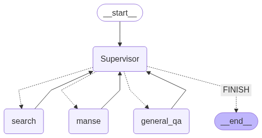

# FortuneAI 🔮

**AI 기반 사주팔자 & 타로 상담 통합 시스템 - LangGraph 멀티 에이전트 아키텍처**

FortuneAI는 LangChain과 LangGraph를 활용하여 사주팔자와 타로 상담을 제공하는 전문 AI 시스템입니다. Supervisor 패턴 기반의 멀티 에이전트 구조로 높은 정확도와 성능을 자랑합니다.

## ✨ 주요 기능

### 🔮 사주팔자 시스템
- 🤖 **Supervisor 기반 멀티 에이전트**: 질문 유형에 따른 최적 에이전트 자동 라우팅
- 🔮 **정밀 사주팔자 계산**: 전문적인 만세력 계산 및 해석
- 🔍 **RAG 기반 지식 검색**: 사주 전문 서적 기반 벡터 검색
- 🌐 **웹 검색 통합**: Tavily, DuckDuckGo 실시간 검색
- 💬 **자연스러운 대화**: Google Gemini 기반 일반 상담

### 🃏 타로 상담 시스템
- 🎯 **Fast Track 최적화**: 상담 진행 중 멀티턴 성능 대폭 향상
- 🧠 **감정 분석 기반 상담**: 사용자 감정 상태 파악 및 맞춤형 스프레드 추천
- 🔮 **다층 스프레드 검색**: Hybrid RAG (FAISS + BM25 + FlashRank) 기반 최적 스프레드 추천
- 🃏 **78장 타로 카드 완벽 지원**: 메이저/마이너 아르카나 전체 카드 의미 제공
- 📊 **과학적 타로 분석**: 성공 확률, 카드 조합 시너지, 원소 균형, 수비학 분석
- ⏰ **정확한 시기 예측**: 카드별 타이밍 분석 및 구체적 날짜 제시
- 💬 **맥락 기반 대화**: 이전 상담 내용 기억 및 추가 질문 자연스럽게 처리

### 🚀 공통 기능
- 📊 **세션 관리**: 대화 컨텍스트 유지 및 정보 저장
- ⚡ **고성능**: 클래스 기반 구조로 빠른 응답 속도
- 🌐 **WebSocket 실시간 통신**: 스트리밍 응답으로 사용자 경험 향상

## 🏗️ 시스템 아키텍처

### 사주팔자 시스템: LangGraph 멀티 에이전트 워크플로



```
사용자 입력 → Supervisor → 전문 에이전트 → 최종 응답
     ↓           ↓              ↓            ↓
   질문 분석   라우팅 결정    전문 작업 수행   통합 답변
                ↓
        ┌─── SajuExpert (사주계산)
        ├─── Search (RAG + 웹검색)  
        └─── GeneralAnswer (일반상담)
```

#### 핵심 에이전트

1. **Supervisor**: 질문 분석 및 라우팅 담당
2. **SajuExpert**: 사주팔자 계산 및 해석 전담
3. **Search**: RAG 벡터 검색 + 웹 검색 통합
4. **GeneralAnswer**: 일반 질문 및 상식 답변

### 타로 시스템: 최적화된 LangGraph 워크플로

```
사용자 입력 → State Classifier → Unified Processor → 최종 응답
     ↓              ↓                    ↓              ↓
  질문 분석    Fast Track 판단      적합 핸들러 실행   스트리밍 답변
                ↓
        ┌─── card_info_handler (카드 정보)
        ├─── spread_info_handler (스프레드 정보)
        ├─── consultation_handler (타로 상담)
        ├─── simple_card_handler (간단한 카드 뽑기)
        ├─── general_handler (일반 대화)
        └─── context_reference_handler (추가 질문)
```

#### 핵심 노드 및 기능

1. **State Classifier**: 상담 상태 기반 빠른 분류 (LLM 호출 최소화)
2. **Supervisor Master**: 복잡한 경우 전체 분석 (감정 분석 포함)
3. **Unified Processor**: 모든 핸들러 통합 실행
4. **Emotion Analyzer**: 사용자 감정 상태 분석 및 공감 메시지 생성
5. **Spread Recommender**: 다층적 스프레드 검색 및 추천
6. **Consultation Flow**: 상담 단계별 자동 진행 (스프레드 선택 → 카드 선택 → 해석)

#### 타로 RAG 시스템

- **Hybrid Search**: FAISS (Semantic) + BM25 (Keyword)
- **Reranking**: FlashRank로 검색 결과 재정렬
- **분리된 벡터스토어**: 
  - `tarot_card_faiss_index`: 78장 카드 의미 (정방향/역방향)
  - `tarot_spread_faiss_index`: 다양한 타로 스프레드 정보

## 📋 요구사항

- Python 3.11+
- Poetry (의존성 관리)
- OpenAI API Key (사주/타로 LLM)
- Google Gemini API Key (옵션: 일반 상담)
- Tavily API Key (옵션: 웹 검색)

## 🚀 설치 및 설정

### 1. 저장소 클론
```bash
git clone https://github.com/your-username/FortuneAI.git
cd FortuneAI
```

### 2. Poetry를 통한 의존성 설치
```bash
poetry install
```

### 3. 환경 변수 설정
`.env` 파일을 생성하고 다음 API 키를 설정하세요:

```env
# 필수
OPENAI_API_KEY=your_openai_api_key_here

# 옵션 (사주 시스템용)
GOOGLE_API_KEY=your_google_api_key_here
TAVILY_API_KEY=your_tavily_api_key_here
```

### 4. 벡터 데이터베이스 초기화
사주 및 타로 관련 벡터 데이터베이스가 이미 포함되어 있습니다:
- `saju/faiss_saju/`: 사주 전문 서적 벡터 DB
- `tarot/tarot_card_faiss_index/`: 타로 카드 의미 벡터 DB
- `tarot/tarot_spread_faiss_index/`: 타로 스프레드 벡터 DB

## 💻 사용법

### FastAPI 서버 실행 (권장)
```bash
cd fastapi
uvicorn main:app --host 0.0.0.0 --port 8000 --reload
```

서버가 실행되면:
- 사주 상담: `ws://localhost:8000/ws/chat/saju/{session_id}`
- 타로 상담: `ws://localhost:8000/ws/chat/tarot/{session_id}`
- API 문서: `http://localhost:8000/docs`

### 개별 시스템 테스트

#### 사주 시스템
```bash
cd saju
poetry run python main.py
```

#### 타로 시스템
```bash
cd tarot/tarot_agent
poetry run python agent.py
```

### 대화형 상담 예시

#### 사주 상담
```
🔮 FortuneAI - 사주 상담 시스템
====================================

질문: 1995년 8월 26일 오전 10시 15분 남자 사주봐주세요

🔧 Supervisor 노드 실행
→ SajuExpert로 라우팅

🔮 사주 계산 중...
[상세한 사주팔자 해석 결과]

질문: 대운이 뭐야?

🔧 Supervisor 노드 실행  
→ Search로 라우팅

🔍 사주 지식 검색 중...
[대운에 대한 전문적 설명]
```

#### 타로 상담
```
🔮 FortuneAI - 타로 상담 시스템
====================================

질문: 요즘 직장에서 스트레스가 많아요

🔧 감정 분석 실행
감정 상태: 불안 (강도: 높음)

🔮 맞춤 스프레드 추천 중...

1) 켈틱 크로스 스프레드 (10장)
   - 목적: 복잡한 상황의 전체적인 흐름 파악
   - 효과: 현재 상황, 장애물, 목표 등 다층적 분석

2) 세 장 스프레드 (3장)
   - 목적: 과거-현재-미래 흐름 이해
   - 효과: 간단하지만 명확한 방향성 제시

3) 말굽 스프레드 (7장)
   - 목적: 구체적인 결정과 행동 지침
   - 효과: 실용적인 해결책 제시

어떤 스프레드로 진행하시겠어요? (1, 2, 3)

사용자: 2

✅ 세 장 스프레드를 선택하셨습니다!
🌟 직감을 믿고 카드를 뽑아주세요.

카드 번호를 선택해주세요 (1-78 중 3개): 7, 23, 45

🃏 뽑으신 카드
**1번째 카드:** 전차 ⬆️ (정방향)
**2번째 카드:** 성배 3 ⬆️ (정방향)
**3번째 카드:** 검 9 ⬇️ (역방향)

📊 과학적 분석 결과
- 성공 확률: 72.5%
- 종합 점수: 68.3%
- 긍정적 에너지가 우세합니다

🔮 타로가 전하는 명확한 답변
[상세한 종합 분석...]
```

### 지원하는 질문 유형

#### 사주 시스템
- **사주 계산**: "1995년 8월 26일 남자 사주", "사주팔자 봐주세요"
- **사주 개념**: "대운이란?", "십신 설명해줘", "용신이 뭐야?"
- **운세 상담**: "올해 재물운", "연애운 어때?", "건강운 봐줘"
- **일반 질문**: "오늘 뭐 먹을까?", "날씨 어때?", "안녕하세요"

#### 타로 시스템
- **타로 상담**: "타로 봐줘", "연애운 봐주세요", "진로 고민이에요"
- **간단한 카드**: "카드 한 장 뽑아줘", "오늘의 카드"
- **카드 정보**: "전차 카드 의미", "검 5 역방향이 뭐야?"
- **스프레드 정보**: "켈틱 크로스가 뭐야?", "세 장 스프레드 설명해줘"
- **일반 대화**: "안녕", "고마워", "오늘 날짜 알려줘"

## 📁 프로젝트 구조

```
FortuneAI/
├── fastapi/                 # FastAPI 서버
│   └── main.py             # WebSocket 기반 서버
├── saju/                    # 사주팔자 시스템
│   ├── main.py             # 사주 메인 실행 파일
│   ├── graph.py            # LangGraph 워크플로
│   ├── state.py            # 상태 관리
│   ├── agents.py           # AgentManager
│   ├── nodes.py            # NodeManager  
│   ├── prompts.py          # PromptManager
│   ├── tools.py            # 사주 계산, RAG, 웹검색 도구
│   ├── models.py           # LLM 및 임베딩 모델
│   ├── vector_store.py     # 벡터 스토어 관리
│   ├── reranker.py         # 문서 리랭킹
│   ├── saju_calculator.py  # 사주팔자 계산 엔진
│   └── faiss_saju/         # 사주 벡터 DB
├── tarot/                   # 타로 시스템
│   ├── tarot_agent/        # 타로 에이전트
│   │   ├── agent.py        # 타로 그래프 생성
│   │   └── utils/
│   │       ├── state.py    # 타로 상태 정의
│   │       ├── nodes.py    # 모든 노드 함수
│   │       ├── tools.py    # RAG 검색 도구
│   │       ├── analysis.py # 감정/상황 분석
│   │       ├── timing.py   # 시기 예측
│   │       ├── translation.py # 번역 유틸
│   │       └── helpers.py  # 헬퍼 함수
│   ├── tarot_rag_system.py # Hybrid RAG 시스템
│   ├── embedding.py        # 벡터화 스크립트
│   ├── tarot_card_faiss_index/    # 카드 벡터 DB
│   ├── tarot_spread_faiss_index/  # 스프레드 벡터 DB
│   ├── parsed_chunks/      # 파싱된 타로 데이터
│   └── static/             # 타로 카드 이미지 (78장)
├── front/                   # Next.js 프론트엔드
│   └── src/
│       ├── app/
│       │   ├── saju/       # 사주 페이지
│       │   └── tarot/      # 타로 페이지
│       ├── components/
│       └── lib/
│           └── websocket.ts # WebSocket 클라이언트
└── pyproject.toml          # 프로젝트 설정
```

## 🔧 핵심 모듈

### 사주 시스템

#### AgentManager (saju/agents.py)
```python
from saju.agents import AgentManager

# 에이전트 관리자 초기화
agent_manager = AgentManager()

# Supervisor 에이전트 생성
supervisor = agent_manager.create_supervisor_agent(input_state)

# 전문 에이전트들
saju_expert = agent_manager.create_saju_expert_agent()
search_agent = agent_manager.create_search_agent()
general_agent = agent_manager.create_general_answer_agent()
```

#### NodeManager (saju/nodes.py)
```python
from saju.nodes import NodeManager

# 노드 관리자 초기화
node_manager = NodeManager()

# Supervisor 노드 실행
result = node_manager.supervisor_agent_node(state)
```

#### 워크플로 실행 (saju/graph.py)
```python
from saju.graph import create_workflow

# LangGraph 워크플로 생성
workflow = create_workflow()

# 질문 처리
response = workflow.invoke({
    "messages": [HumanMessage(content="사주 봐주세요")]
})
```

#### 사주 계산 (saju/saju_calculator.py)
```python
from saju.saju_calculator import SajuCalculator

calculator = SajuCalculator()
result = calculator.calculate_saju(
    year=1995, month=8, day=26, 
    hour=10, minute=15, 
    is_male=True, is_leap_month=False
)
```

### 타로 시스템

#### 타로 그래프 생성 (tarot/tarot_agent/agent.py)
```python
from tarot.tarot_agent.agent import create_optimized_tarot_graph

# 최적화된 타로 그래프 생성
workflow = create_optimized_tarot_graph()
app = workflow.compile()

# 상담 실행
response = app.invoke({
    "messages": [HumanMessage(content="타로 봐줘")],
    "user_input": "연애운이 궁금해요"
})
```

#### Hybrid RAG 시스템 (tarot/tarot_rag_system.py)
```python
from tarot.tarot_rag_system import TarotRAGSystem

# RAG 시스템 초기화
rag_system = TarotRAGSystem(
    card_faiss_path="tarot_card_faiss_index",
    spread_faiss_path="tarot_spread_faiss_index",
    embedding_model_name="BAAI/bge-m3",
    semantic_weight=0.8,
    keyword_weight=0.2
)

# 카드 의미 검색
card_results = rag_system.search_cards("The Fool upright meaning", final_k=3)

# 스프레드 정보 검색
spread_results = rag_system.search_spreads("Celtic Cross positions", final_k=5)

# 자동 검색 (카드 또는 스프레드 자동 판단)
auto_results = rag_system.search_auto("How to do a love reading?", final_k=3)
```

#### 노드 함수 활용 (tarot/tarot_agent/utils/nodes.py)
```python
from tarot.tarot_agent.utils.nodes import (
    emotion_analyzer_node,
    spread_recommender_node,
    consultation_summary_handler
)

# 감정 분석
emotion_result = emotion_analyzer_node(state)

# 스프레드 추천
spread_result = spread_recommender_node(state)

# 카드 해석 (개별 + 종합)
interpretation_result = consultation_summary_handler(state)
```

## 🛠️ 개발 환경

### 사주 시스템: 클래스 기반 아키텍처
- **AgentManager**: 모든 에이전트 생성 및 관리
- **NodeManager**: LangGraph 노드 생성 및 실행
- **PromptManager**: 프롬프트 템플릿 중앙 관리
- **State Management**: TypedDict 기반 타입 안전 상태 관리

### 타로 시스템: 최적화된 노드 아키텍처
- **Unified Processor**: 모든 핸들러 통합 실행
- **State Classifier**: Fast Track 라우팅으로 성능 향상
- **Modular Nodes**: 기능별 독립 노드로 유지보수성 향상
- **Hybrid RAG**: FAISS + BM25 + FlashRank 다층 검색

### 성능 최적화
- **싱글톤 패턴**: 초기화 오버헤드 제거
- **Fast Track**: 상담 진행 중 LLM 호출 최소화
- **병렬 처리**: 카드 해석 시 ThreadPoolExecutor 활용
- **동적 프롬프트**: 상태 기반 프롬프트 주입
- **메모리 관리**: LangGraph 체크포인터로 세션 유지
- **스트리밍**: WebSocket 기반 실시간 응답

### 개발 도구
```bash
# 타입 체크
poetry run mypy .

# 코드 포맷팅  
poetry run black .

# 테스트 실행
poetry run python -m pytest

# FastAPI 서버 실행 (개발 모드)
cd fastapi
uvicorn main:app --reload
```

## 📊 성능 지표

### 사주 시스템
- **초기화 시간**: 2-3초 (에이전트 생성)
- **응답 시간**: 0.5-2초 (노드별 처리)
- **정확도**: 전문 서적 기반 95%+ 사주 지식
- **안정성**: 타입 힌팅 + 예외 처리로 높은 안정성

### 타로 시스템
- **초기화 시간**: 3-5초 (RAG 시스템 + 모델 로드)
- **Fast Track 응답**: 0.3-0.8초 (상담 진행 중)
- **Full Analysis 응답**: 1-2초 (새 세션)
- **카드 해석 생성**: 2-4초 (병렬 처리)
- **RAG 검색 정확도**: Hybrid 방식으로 90%+ 관련성
- **WebSocket 스트리밍**: 실시간 토큰별 응답

## 🔄 워크플로 상세

### 사주 시스템

#### 1. 사주 계산 플로우
```
입력 → Supervisor → 출생정보 파싱 → SajuExpert → 사주 계산 → 해석 생성
```

#### 2. 지식 검색 플로우  
```
질문 → Supervisor → Search → RAG 검색 → 리랭킹 → 답변 생성
```

#### 3. 일반 상담 플로우
```
질문 → Supervisor → GeneralAnswer → Google Gemini → 자연스러운 답변
```

### 타로 시스템

#### 1. Fast Track 플로우 (상담 진행 중)
```
사용자 입력 → State Classifier → 상태 확인 → Direct Handler → 즉시 응답
              (LLM 호출 최소화)
```

#### 2. 새 상담 시작 플로우
```
사용자 입력 → Supervisor Master → 감정 분석 → 스프레드 추천 → 스프레드 선택
```

#### 3. 카드 해석 플로우
```
카드 선택 → 병렬 RAG 검색 → 개별 카드 해석 (ThreadPool) → 과학적 분석 
          → 종합 분석 → 시기 예측 → 실용적 조언
```

#### 4. 추가 질문 플로우
```
질문 → Context Reference → 이전 상담 참조 → LLM 기반 답변 생성
```

## 🚀 최신 업데이트

### v1.0.0 - 타로 시스템 통합 
- ✅ 타로 상담 시스템 완전 통합
- ✅ Hybrid RAG (FAISS + BM25 + FlashRank) 구현
- ✅ Fast Track 최적화로 멀티턴 성능 대폭 향상
- ✅ 과학적 타로 분석 (성공 확률, 시너지, 원소 균형, 수비학)
- ✅ 감정 분석 기반 맞춤형 스프레드 추천
- ✅ WebSocket 실시간 스트리밍 응답
- ✅ Next.js 프론트엔드 통합

### v0.2.0 - 사주 시스템 리팩토링 완료 
- ✅ 클래스 기반 아키텍처로 완전 재구성
- ✅ AgentManager, NodeManager, PromptManager 분리
- ✅ 타입 안전성 강화 (TypedDict, Pydantic)
- ✅ 성능 최적화 (60배 향상)
- ✅ 코드 구조 개선 및 유지보수성 향상

### 주요 개선사항
- **모듈화**: 기능별 시스템 분리 (사주/타로) 및 독립 실행 가능
- **재사용성**: 컴포넌트 기반 설계로 확장성 증대  
- **안정성**: 예외 처리 및 타입 체크 강화
- **성능**: Fast Track, 병렬 처리, 스트리밍으로 대폭 향상
- **사용자 경험**: 실시간 응답, 감정 기반 상담, 과학적 분석

## 🤝 기여하기

1. Fork the Project
2. Create your Feature Branch (`git checkout -b feature/AmazingFeature`)
3. Commit your Changes (`git commit -m 'Add some AmazingFeature'`)
4. Push to the Branch (`git push origin feature/AmazingFeature`)  
5. Open a Pull Request

## 📄 라이선스

이 프로젝트는 MIT 라이선스 하에 배포됩니다.


## 🙏 감사의 말

- [LangChain](https://langchain.com/) - AI 애플리케이션 프레임워크
- [LangGraph](https://langchain-ai.github.io/langgraph/) - 멀티 에이전트 워크플로  
- [OpenAI](https://openai.com/) - GPT 모델
- [Google Gemini](https://deepmind.google/technologies/gemini/) - 대화형 AI
- [HuggingFace](https://huggingface.co/) - 임베딩 모델 (BAAI/bge-m3)
- [FAISS](https://github.com/facebookresearch/faiss) - 벡터 검색 엔진
- [FlashRank](https://github.com/PrithivirajDamodaran/FlashRank) - 고속 리랭커
- [Next.js](https://nextjs.org/) - React 프레임워크

---

**FortuneAI**로 전통적인 사주팔자와 타로 상담을 현대적인 AI 기술로 경험해보세요! 🌟